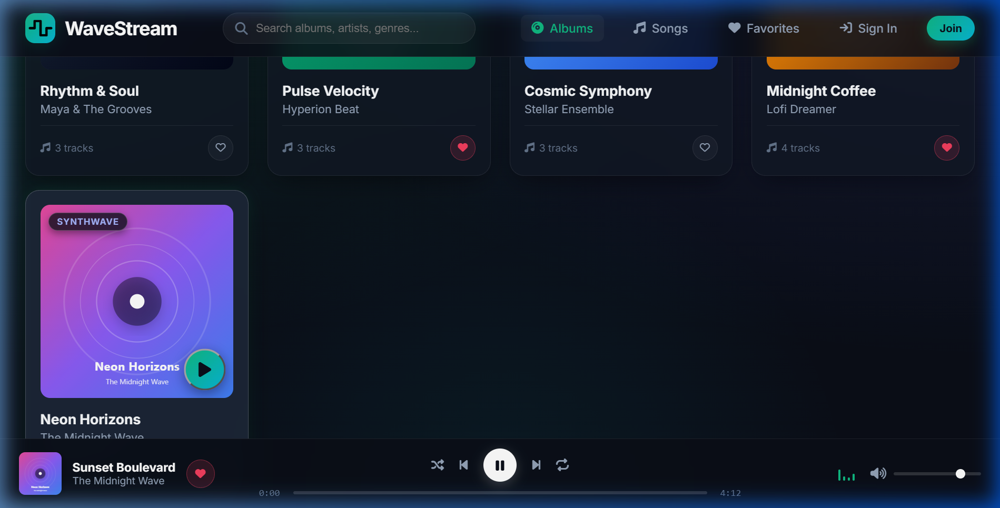
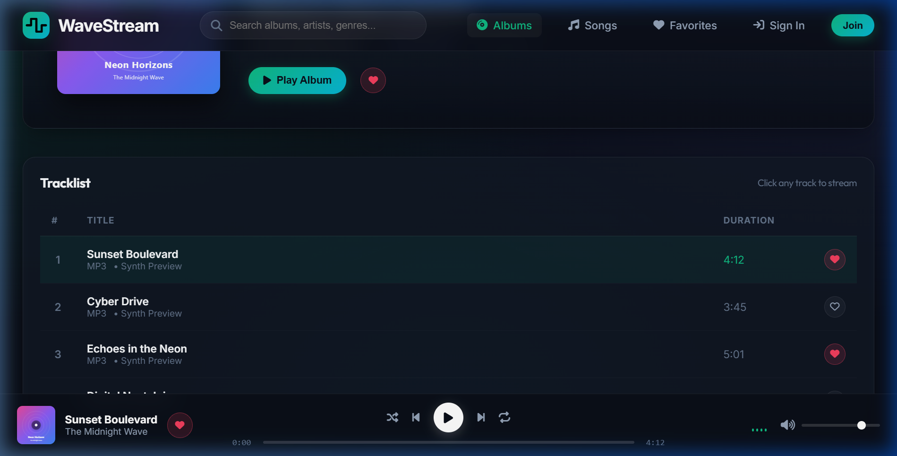
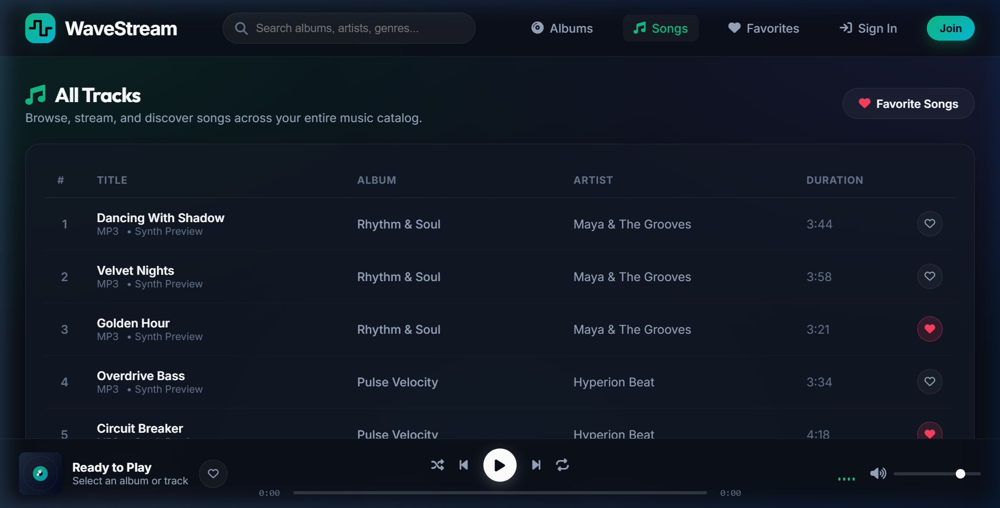
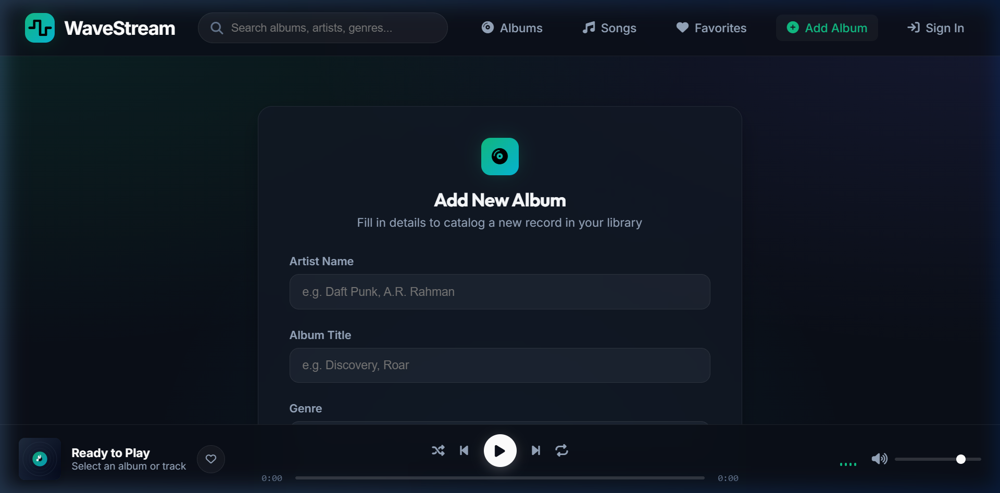

# WaveStream

[](https://www.python.org/)
[](https://www.djangoproject.com/)
[](https://www.docker.com/)
[](LICENSE)

WaveStream is a self-hosted music catalog and web streaming application built with **Django 5** and **vanilla ES6 JavaScript**. It features an interactive persistent audio player, album and track management, role-based permissions (Artists vs. Listeners), and a modern dark interface inspired by modern streaming services.

The project is fully containerized with **Docker** and pre-configured for one-click deployment on **Render** (or any container hosting provider).

---

## Table of Contents

- [Overview](#overview)
- [Screenshots](#screenshots)
- [Key Features](#key-features)
- [Architecture & Tech Stack](#architecture--tech-stack)
- [Project Layout](#project-layout)
- [Prerequisites](#prerequisites)
- [Local Setup (Virtualenv)](#local-setup-virtualenv)
- [Running with Docker](#running-with-docker)
- [Deployment on Render](#deployment-on-render)
- [User Roles & Permissions](#user-roles--permissions)
- [Testing](#testing)
- [Honest Limitations & Considerations](#honest-limitations--considerations)
- [License](#license)

---

## Overview

WaveStream started as a classic Django music library project and was rebuilt into a full-featured web app with a responsive dark glassmorphic design, client-side player state management, and containerized deployment workflows.

It is intended as a **portfolio project, learning resource, or personal self-hosted music catalogue**. It does not attempt to replicate a multi-tenant commercial streaming backend like Spotify; instead, it focuses on solid Django architecture, clean vanilla JavaScript (no heavy frontend frameworks), and frictionless containerized deployment.

---

## 📸 Screenshots

### 1. Home Library & Persistent Audio Player
*Browse album collections, filter by genre, and control playback with the persistent bottom audio player.*


### 2. Album Details & Tracklist
*View high-res album artwork, metadata, track durations, and trigger individual songs while playback continues seamlessly.*


### 3. Global Songs Catalogue
*Search across the entire catalog with real-time filtering, audio duration counters, and one-click AJAX favorites.*


### 4. Creator Studio: Add & Edit Album
*Role-restricted creator portal with live client-side image preview for album artwork uploads.*


---

## Key Features


### 🎧 Persistent Bottom Audio Player
- **Full Player Controls**: Play/pause, track scrubbing with elapsed/remaining timestamps (`mm:ss`), previous/next, shuffle, and repeat modes.
- **Volume & Equalizer**: Real-time volume slider, mute toggle, and an animated playback equalizer.
- **Dual Audio Engine**:
  - Plays uploaded user audio files (`.mp3`, `.wav`) via the standard HTML5 Audio API.
  - **Procedural Synthesizer Fallback**: Tracks without uploaded audio files automatically generate harmonic ambient synthesizer tones using the browser's native Web Audio API, so the app remains interactive and audible right out of the box.

### 💿 Music Management & Discovery
- **Album & Track Cataloging**: Create, edit, and organize albums and tracklists.
- **Live Image Preview**: Instant client-side artwork preview during album creation.
- **Search & Genre Filtering**: Search albums by title, artist, genre, or track name, paired with quick genre pills (Synthwave, Lo-Fi, Electronic, Classical, Pop).
- **AJAX Favorites**: Toggle album and song favorites asynchronously without jarring page reloads.

### 👥 User Roles & Access Control
- **Listener Accounts**: Browse catalog, stream music, search, and curate personal favorites.
- **Artist / Creator Accounts**: Full catalog permissions—publish albums, upload audio files, and edit metadata.
- **Ownership Protection**: Artists can only edit or delete albums and songs that belong to them.

### 🚀 Production-Ready & Dockerized
- **WhiteNoise Integration**: Static assets are served directly through Django with compression and cache headers.
- **Database Flexibility**: Uses `dj-database-url` to connect automatically to PostgreSQL (e.g. Render Postgres) when `DATABASE_URL` is present, with automatic fallback to SQLite for local development.
- **Automated Seeding**: Startup scripts verify the database and automatically seed sample demo albums, songs, and SVG vinyl covers if the database is fresh.

---

## Architecture & Tech Stack

| Layer | Technology | Details |
|---|---|---|
| **Backend** | Python 3.11+, Django 5.x | MTV architecture, class-based views, Django Auth & ModelForms |
| **WSGI Server** | Gunicorn | Multi-worker HTTP server for production container runtime |
| **Static Serving** | WhiteNoise | Compressed, manifest-backed static asset delivery without an Nginx sidecar |
| **Database** | SQLite / PostgreSQL | Local file database with seamless `DATABASE_URL` PostgreSQL support |
| **Frontend** | Vanilla JavaScript (ES6+), HTML5, CSS3 | Custom dark glassmorphic theme, Web Audio API tone synthesis, zero heavy JS frameworks |
| **Container** | Docker & Docker Compose | Lightweight `python:3.11-slim` image, multi-arch support, non-buffered logging |
| **Hosting** | Render | Native Blueprint deployment via `render.yaml` |

---

## Project Layout

```text
Music-App/
├── Dockerfile                  # Production container definition
├── docker-compose.yml          # Local container orchestration
├── entrypoint.sh               # Migration, static collection & startup script
├── render.yaml                 # Render Blueprint specification
├── requirements.txt            # Python dependencies
├── manage.py                   # Django CLI
├── website/                    # Core project configuration
│   ├── settings.py             # Settings (WhiteNoise, dj-database-url, CSRF, Storages)
│   ├── urls.py                 # Root URL configuration & media routing
│   └── wsgi.py                 # WSGI application entry
└── music/                      # Main music application
    ├── models.py               # Album, Song, and UserProfile models
    ├── views.py                # CRUD views, AJAX toggle endpoints, auth flows
    ├── urls.py                 # App route declarations
    ├── forms.py                # AlbumForm, SongForm, UserRegisterForm
    ├── tests.py                # Unit and integration test suite (12 tests)
    ├── static/music/           # Frontend stylesheets & player script
    │   ├── style.css           # Modern dark glassmorphic styling
    │   ├── player.js           # Audio player engine & procedural synthesizer
    │   └── images/             # Default SVG placeholders
    ├── templates/music/        # HTML templates
    │   ├── layout.html         # Base layout with navbar & audio player bar
    │   ├── index.html          # Album grid discovery & genre filters
    │   ├── detail.html         # Album tracklist & song upload modal
    │   ├── songs.html          # Global tracks table
    │   ├── album_form.html     # Add/edit album with live image preview
    │   ├── login.html          # User login
    │   └── register.html       # Role-selectable registration
    └── management/commands/
        └── seed_demo.py        # Demo catalogue seeder
```

---

## Prerequisites

- **Python**: 3.11 or higher
- **pip**: Latest version
- *(Optional for containers)*: **Docker Desktop** / Docker Engine

---

## Local Setup (Virtualenv)

### 1. Clone the repository
```bash
git clone https://github.com/santoshkkashyap25/Music-App.git
cd Music-App
```

### 2. Create and activate a virtual environment
**Windows (PowerShell):**
```powershell
python -m venv venv
.\venv\Scripts\Activate.ps1
```

**macOS / Linux:**
```bash
python3 -m venv venv
source venv/bin/activate
```

### 3. Install dependencies
```bash
pip install -r requirements.txt
```

### 4. Run database migrations
```bash
python manage.py migrate
```

### 5. Seed sample demo music (Recommended)
```bash
python manage.py seed_demo
```
*Seeds 5 albums across multiple genres with 17 tracks and procedural SVG vinyl covers.*

### 6. Run the local development server
```bash
python manage.py runserver 8000
```
Open your browser at [http://127.0.0.1:8000/](http://127.0.0.1:8000/).

---

## Running with Docker

### Using Docker Compose (Recommended for local testing)

Run the following command in the project root:
```bash
docker compose up --build -d
```

- Access the app at: **[http://127.0.0.1:8000/](http://127.0.0.1:8000/)**
- View logs: `docker compose logs -f`
- Stop the container: `docker compose down`

> [!NOTE]
> **Windows Users**: Access the application via `http://127.0.0.1:8000` rather than `http://localhost:8000`. On some Windows configurations with WSL2, `localhost` resolves to IPv6 `[::1]`, which can cause connection resets with Docker port proxies. `127.0.0.1` routes directly over IPv4 without issue.

### Using Standard Docker Commands
```bash
# 1. Build the Docker image
docker build -t music-app .

# 2. Run the container
docker run -d -p 8000:8000 --name music-app-live -e DEBUG=True -e SECRET_KEY=your-dev-secret music-app

# 3. View container logs
docker logs -f music-app-live

# 4. Stop container
docker stop music-app-live
```

---

## Deployment on Render

This project includes a native `render.yaml` Blueprint file for automated deployment.

### Option A: Render Blueprint (Recommended)
1. Push this repository to your GitHub account.
2. Navigate to your [Render Dashboard](https://dashboard.render.com/).
3. Click **New +** → **Blueprint**.
4. Connect your GitHub repository.
5. Render detects [render.yaml](render.yaml) and configures:
   - Environment: `Docker`
   - Plan: `Free`
   - Health check path: `/music/`
   - Automatic environment variables (`SECRET_KEY`, `DEBUG=False`, `WEB_CONCURRENCY=2`).
6. Click **Apply**. Render will build the container, run migrations, collect static assets, seed demo data, and deploy the live app.

### Option B: Manual Web Service
1. In Render, click **New +** → **Web Service**.
2. Connect your repository.
3. Select **Docker** as the Runtime.
4. Set the following environment variables:
   - `DEBUG`: `False`
   - `SECRET_KEY`: (Provide a long, random string)
   - `WEB_CONCURRENCY`: `2`
5. Click **Create Web Service**.

---

## User Roles & Permissions

| Role | Browse & Stream | Favorite Tracks / Albums | Create Albums | Upload Songs | Edit / Delete Own Albums |
|---|:---:|:---:|:---:|:---:|:---:|
| **Anonymous / Guest** | ✅ | ❌ *(Redirects to login)* | ❌ | ❌ | ❌ |
| **Listener** | ✅ | ✅ | ❌ | ❌ | ❌ |
| **Artist / Creator** | ✅ | ✅ | ✅ | ✅ | ✅ |

To test roles:
- Register a new account at `/music/register/` and select **Listener** or **Artist / Creator**.
- When logged in as an Artist, you can access the "Add Album" button, upload custom cover art, and add tracks.
- Listeners see a clean streaming interface without management buttons.

---

## Testing

The project includes an automated test suite covering models, class-based views, search, role-based permissions, and AJAX favorite endpoints:

```bash
python manage.py test
```

Expected output:
```text
Creating test database for alias 'default'...
............
----------------------------------------------------------------------
Ran 12 tests in ~1.5s

OK
Destroying test database for alias 'default'...
```

---

## Honest Limitations & Considerations

To set realistic expectations:

1. **Ephemeral Filesystems in Free Cloud Containers**:
   - In free cloud container environments (such as Render's free tier), the container filesystem is ephemeral. Files uploaded by users (new album art or uploaded MP3s) will reset when the container spins down due to inactivity.
   - *Production Solution*: For production environments requiring persistent user uploads, attach a persistent disk (e.g. Render Persistent Disk mounted at `/app/media`) or integrate an S3-compatible object storage provider (e.g. AWS S3, Cloudflare R2 via `django-storages`).
2. **Audio Streaming Scope**:
   - Audio is streamed using standard HTTP range responses provided by Django/Gunicorn and handled natively by the browser. It is well-suited for MP3/WAV tracks, but does not use adaptive bitrate streaming (HLS/DASH).
3. **Synthesis Engine**:
   - The procedural synthesizer is an intentional fallback for demoing and previewing tracks when physical audio files are not uploaded. It uses simple Web Audio oscillator chords.

---

## License

This project is licensed under the [MIT License](LICENSE).
